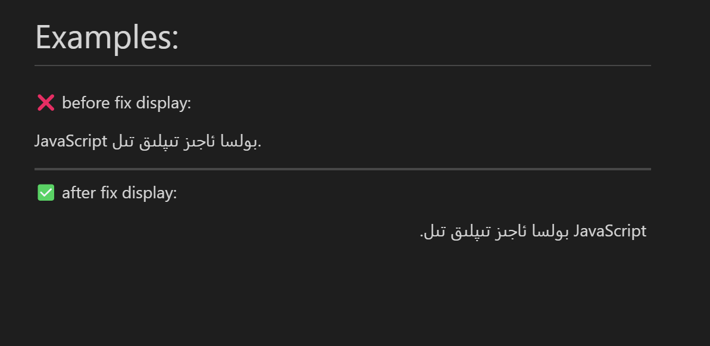

# Obsidian-Insert-Invisible-RTL-Character
### ⚠️ note: this plugin only works right-to-left oriented languages.

# Intention
when write an article from right to left direction form, many editor and websites could display direction correctly. however, **If the first Character/letter in the line** is left-to-right oriented language character, the line becomes left to right display mode.

# Method
this plugin fix this issue from inserting a invisible zero-width-joiner(known as zwj) character in Unicode(U+061C) **After** cursor, so that the first line handled as RTL, and the text display in correct direction.

✨ U+06C1: 
The Arabic letter mark (ALM) is a non-printing character used in the computerized typesetting of bi-directional text containing mixed left-to-right scripts (such as Latin and Cyrillic) and right-to-left scripts (such as Arabic, Syriac and Hebrew). Similar to Right-to-left mark (RLM: U+200F), it is used to change the way adjacent characters are grouped with respect to text direction, with some difference on how it affects the bidirectional level resolutions for nearby characters.

# Examples:

❌ before fix display:

JavaScript بولسا ئاجىز تىپلىق تىل.

---

✅ after fix display:

؜ JavaScript بولسا ئاجىز تىپلىق تىل.

---

below is example screenshot if its not display correct in your editor

